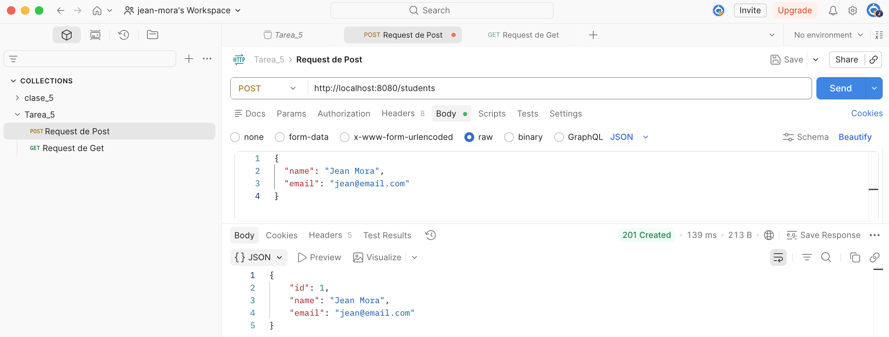
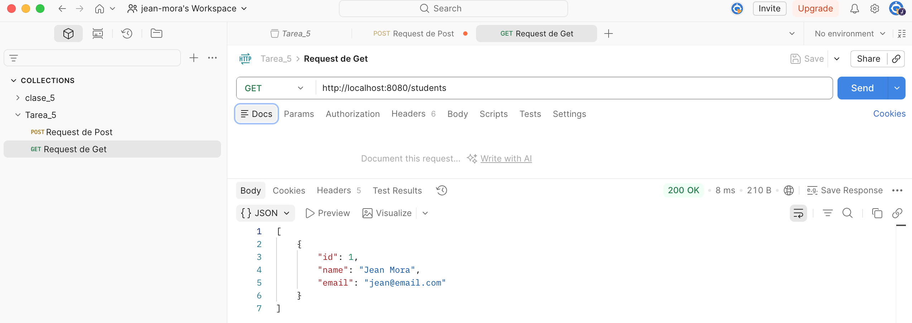
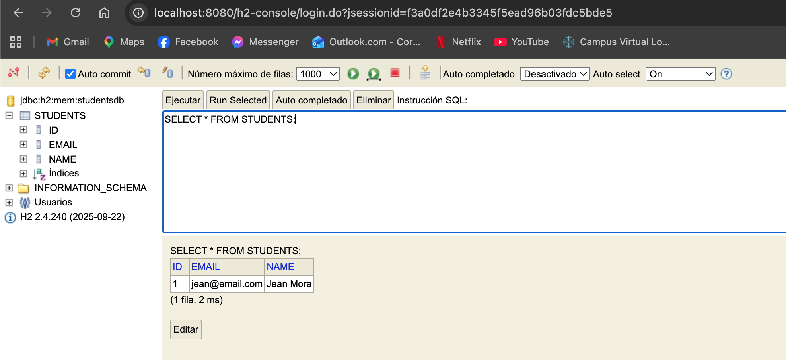

# API REST de Estudiantes

## Descripción

Este proyecto corresponde al desarrollo de una API REST utilizando Spring Boot y Kotlin para la gestión de estudiantes. La aplicación permite registrar estudiantes y consultar todos los estudiantes almacenados en una base de datos H2.

La solución fue desarrollada siguiendo una arquitectura por capas, separando las responsabilidades en Controller, Service y Repository, con el objetivo de mantener un código organizado, escalable y fácil de mantener.

---

## Objetivo

Implementar una API REST que permita:

* Registrar estudiantes.
* Consultar todos los estudiantes registrados.
* Almacenar la información en una base de datos H2.
* Aplicar una arquitectura por capas utilizando Spring Boot y Kotlin.

---

## Tecnologías utilizadas

* Kotlin
* Spring Boot
* Spring Data JPA
* H2 Database
* Gradle
* Postman

---

## Arquitectura del proyecto

```text
src/main/kotlin/ec/edu/puce/studentapi
├── controller
│   └── StudentController.kt
├── dto
│   ├── StudentRequest.kt
│   └── StudentResponse.kt
├── entity
│   └── Student.kt
├── repository
│   └── StudentRepository.kt
├── service
│   └── StudentService.kt
└── StudentapiApplication.kt
```

### Descripción de las capas

| Capa       | Responsabilidad                                                 |
| ---------- | --------------------------------------------------------------- |
| Controller | Recibe las solicitudes HTTP y devuelve las respuestas.          |
| Service    | Contiene la lógica de negocio de la aplicación.                 |
| Repository | Gestiona el acceso a la base de datos mediante Spring Data JPA. |
| Entity     | Representa la tabla almacenada en la base de datos.             |
| DTO        | Define la información que entra y sale de la API.               |

---

## Entidad Student

La entidad utilizada en el proyecto es:

| Campo | Tipo   |
| ----- | ------ |
| id    | Long   |
| name  | String |
| email | String |

---

## Endpoints implementados

### Crear estudiante

**POST** `/students`

#### Request

```json
{
  "name": "Ana Torres",
  "email": "ana.torres@email.com"
}
```

#### Response

```json
{
  "id": 1,
  "name": "Ana Torres",
  "email": "ana.torres@email.com"
}
```

---

### Obtener todos los estudiantes

**GET** `/students`

#### Response

```json
[
  {
    "id": 1,
    "name": "Ana Torres",
    "email": "ana.torres@email.com"
  }
]
```

---

## Configuración de H2

### Consola H2

```text
http://localhost:8080/h2-console
```

### Datos de conexión

```text
JDBC URL: jdbc:h2:mem:studentsdb
Usuario: sa
Contraseña:
```

---

## Ejecución del proyecto

### Clonar repositorio

```bash
git clone <URL_DEL_REPOSITORIO>
```

### Ingresar al proyecto

```bash
cd studentapi
```

### Ejecutar la aplicación

```bash
./gradlew bootRun
```

### Acceder a la API

```text
http://localhost:8080/students
```

---

## Evidencias

### Prueba POST /students



### Prueba GET /students



### Consulta en H2



---

## Colección Postman

La colección utilizada para las pruebas se encuentra en la carpeta:

```text
postman/
```

---

## Autor

**Jean Pierre Mora Santillán**

Pontificia Universidad Católica del Ecuador (PUCE)

Tecnología Superior en Desarrollo de Software

---
